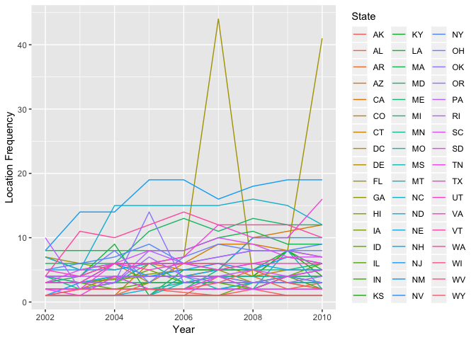
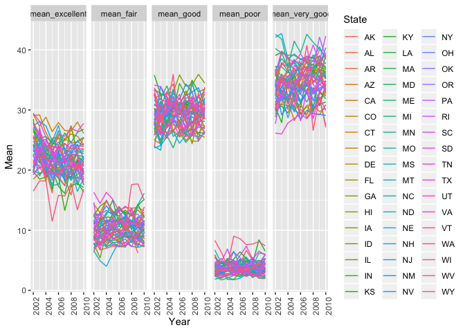
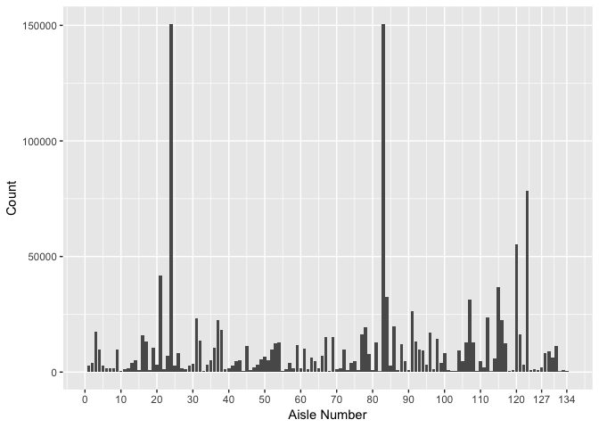
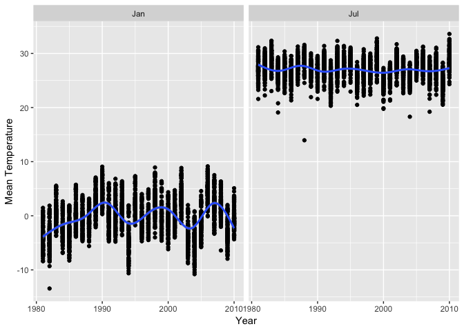
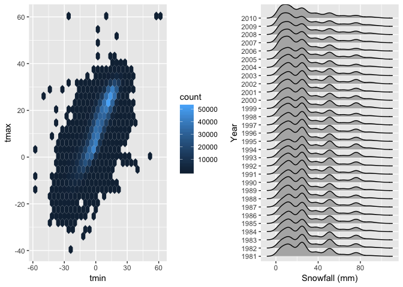

p8105\_hw3\_gwk2111
================
Zach Keefer
10/11/2018

Problem 1
---------

``` r
brfss_data = brfss_smart2010 %>% 
  janitor::clean_names() %>%
  filter(topic == "Overall Health") %>% 
  mutate(response = factor(response, levels = c("Excellent", "Very good", "Good", "Fair", "Poor"), ordered = TRUE))
```

``` r
filter(brfss_data, year == 2002) %>% 
  group_by(locationabbr) %>% 
  summarise(location_freq = n_distinct(geo_location)) %>% 
  filter(location_freq == 7)
```

    ## # A tibble: 3 x 2
    ##   locationabbr location_freq
    ##   <chr>                <int>
    ## 1 CT                       7
    ## 2 FL                       7
    ## 3 NC                       7

``` r
group_by(brfss_data, locationabbr, year) %>% 
  summarise(location_freq = n_distinct(geo_location)) %>%  
   ggplot(aes(x = year, y = location_freq)) +
       geom_line(aes(color = locationabbr))   
```



``` r
filter(brfss_data, year == 2002 | year == 2006 | year == 2010, locationabbr == "NY") %>% 
  spread(key = response, value = data_value) %>% 
  group_by(year) %>% 
  summarize(mean_proportion = mean(Excellent, na.rm = TRUE),
            sd = sd(Excellent, na.rm = TRUE)) %>% 
  knitr::kable(digits = 3)
```

|  year|  mean\_proportion|     sd|
|-----:|-----------------:|------:|
|  2002|            24.040|  4.486|
|  2006|            22.533|  4.001|
|  2010|            22.700|  3.567|

``` r
spread(brfss_data, key = response, value = data_value) %>% 
  janitor::clean_names() %>% 
  group_by(locationabbr, year) %>% 
  summarize(mean_excellent = mean(excellent, na.rm = TRUE),
         mean_very_good = mean(very_good, na.rm = TRUE),
         mean_good = mean(good, na.rm = TRUE),
         mean_fair = mean(fair, na.rm = TRUE),
         mean_poor = mean(poor, na.rm = TRUE)) %>%
  gather(key = response, value = mean, mean_excellent:mean_poor) %>% 
  ggplot(aes(x = year, y = mean)) +
  geom_line(aes(color = locationabbr)) +
  facet_grid(~response)
```



Problem 2
---------

``` r
instacart = instacart %>% 
  janitor::clean_names()
```

``` r
count(instacart, aisle_id) %>% 
  nrow()
```

    ## [1] 134

``` r
count(instacart, aisle_id) %>% 
  filter(min_rank(desc(n)) < 2)
```

    ## # A tibble: 1 x 2
    ##   aisle_id      n
    ##      <int>  <int>
    ## 1       83 150609

``` r
group_by(instacart, aisle) %>% 
  summarize(n = n()) %>% 
  ggplot(aes(x = aisle, y = n)) +
  geom_bar(stat = "identity") 
```



``` r
filter(instacart, aisle == "baking ingredients" | aisle == "dog food care" | aisle == "packaged vegetables fruits") %>% 
  group_by(aisle, product_name) %>% 
  summarize(most_popular = n()) %>%
  filter(min_rank(desc(most_popular)) < 2) %>% 
  knitr::kable()
```

| aisle                      | product\_name                                 |  most\_popular|
|:---------------------------|:----------------------------------------------|--------------:|
| baking ingredients         | Light Brown Sugar                             |            499|
| dog food care              | Snack Sticks Chicken & Rice Recipe Dog Treats |             30|
| packaged vegetables fruits | Organic Baby Spinach                          |           9784|

``` r
library(lubridate)
```

    ## 
    ## Attaching package: 'lubridate'

    ## The following object is masked from 'package:base':
    ## 
    ##     date

``` r
filter(instacart, product_name == "Pink Lady Apples" | product_name == "Coffee Ice Cream") %>% 
  mutate(order_dow = order_dow + 1) %>% 
  mutate(day = wday(order_dow, label = TRUE)) %>% 
  group_by(day, product_name) %>%
  summarise(mean_hour = mean(order_hour_of_day)) %>% 
  spread(key = product_name, value = mean_hour) %>% 
  knitr::kable()
```

| day |  Coffee Ice Cream|  Pink Lady Apples|
|:----|-----------------:|-----------------:|
| Sun |          13.77419|          13.44118|
| Mon |          14.31579|          11.36000|
| Tue |          15.38095|          11.70213|
| Wed |          15.31818|          14.25000|
| Thu |          15.21739|          11.55172|
| Fri |          12.26316|          12.78431|
| Sat |          13.83333|          11.93750|

Problem 3
---------

``` r
ny_noaa = ny_noaa %>% 
  janitor::clean_names()
```

``` r
ny_noaa = ny_noaa %>% 
  mutate(year = year(date),
       month = month(date, label = TRUE),
       day = lubridate::floor_date(date, unit = "day"),
       prcp = prcp/10,
       tmin = (as.numeric(tmin))/10,
       tmax = (as.numeric(tmax))/10) 
 
count(ny_noaa, snow) %>%
  filter(min_rank(desc(n)) < 2) 
```

    ## # A tibble: 1 x 2
    ##    snow       n
    ##   <int>   <int>
    ## 1     0 2008508

``` r
filter(ny_noaa, month == "Jan" | month == "Jul") %>% 
  group_by(month, id, year) %>% 
  summarize(mean_temp = mean(tmax, na.rm = FALSE)) %>% 
  ggplot(aes(x = year, y = mean_temp)) +
  geom_point() +
  geom_smooth() +
  facet_grid(~month)
```

    ## `geom_smooth()` using method = 'gam' and formula 'y ~ s(x, bs = "cs")'

    ## Warning: Removed 7058 rows containing non-finite values (stat_smooth).

    ## Warning: Removed 7058 rows containing missing values (geom_point).



``` r
library(hexbin)
library(ggridges)
```

    ## 
    ## Attaching package: 'ggridges'

    ## The following object is masked from 'package:ggplot2':
    ## 
    ##     scale_discrete_manual

``` r
library(patchwork)
tmax_tmin_p = ggplot(ny_noaa, aes(x = tmax, y = tmin)) +
  geom_hex() 

snowfall_p = filter(ny_noaa, snow > 0 & snow < 100) %>%
  mutate(year = as.character(year)) %>% 
  ggplot(aes(x = snow, y = year)) + 
  geom_density_ridges() 

(tmax_tmin_p + snowfall_p)
```

    ## Warning: Removed 1136276 rows containing non-finite values (stat_binhex).

    ## Picking joint bandwidth of 3.76


